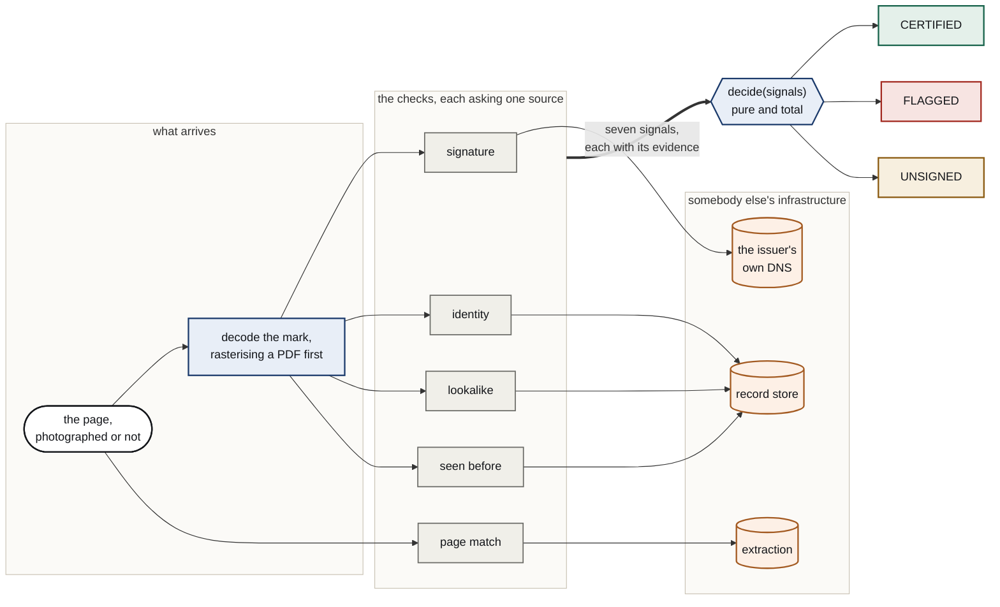

# Signet

Documents that prove who sent them.

A company publishes a public key on the web domain they already own. Every
invoice they send carries a signature over the account number, the amount and
the reference. If any of those change afterwards, the signature stops matching,
and anyone can see it with two commands and no account.

The point is the direction of the question. Every other tool looks at the
document and guesses whether it is genuine, and the forger has a copy of that
tool. Signet does not look at the document. It asks the sender.

**Live:** [the site](https://signet-lime.vercel.app) ·
[check a document](https://signet-lime.vercel.app/verify/) ·
[verifier API](https://signet-q89e.onrender.com/api/health).
The check page brings its own documents, so trying it needs nothing from here.

## Why

| | |
| --- | --- |
| $3.05B | lost to business email compromise in 2025, where an invoice arrives from a real supplier with the bank details changed |
| $122k | average loss per report |
| 86% | of that money moves by wire or ACH, so by the time anyone notices it has gone |
| 71% | of flagged fake receipts were machine generated by mid 2026, up from zero fourteen months earlier |

Losses and averages from the FBI Internet Crime Complaint Center 2025 annual
report. Receipt figures from AppZen, twelve months to May 2026.

## What it does, demonstrated

Three documents, all produced and checked by the running system:

| Document | Verdict | Why |
| --- | --- | --- |
| Genuine invoice | CERTIFIED | signed by the domain the brand signs from, and the page matches the signature |
| Same invoice, account swapped | FLAGGED | the page shows `GB94BARC…` where the signature covers `GB29NWBK…` |
| Invoice from a lookalike domain | FLAGGED | names Northpost, but `north-post.dev` is North Post Holdings |

Nothing about the third is forged. A real domain, a real key, a real signature.
The name is the forgery, and that is the case a signature alone cannot see.

## Verify one by hand

You do not need this repository to check a Signet document.

```console
$ dig +short TXT _signet.northpost.dev
"v=SIGNET1; k=ed25519; p=Kqf0GFh29fslh099Tr9ruRvy6qI7ITeKC5KY8Wt0YWI="

$ openssl pkeyutl -verify -pubin -inkey pub.pem -rawin -in payload.txt -sigfile sig.bin
Signature Verified Successfully
```

Change one digit of the amount and the second command fails. The full
walkthrough, including how to pull the mark off the page, is in
[docs/verify-by-hand.md](docs/verify-by-hand.md). It was written by running it.

## Quick start

```bash
git clone https://github.com/projects-hacks/signet
cd signet
cp .env.example .env      # fixtures are on by default, so no keys are needed
make setup
make test
```

`make test` runs entirely offline against in-memory fakes and needs no
credentials. It is not asked to behave: the suite blocks outbound sockets, so a
test that reaches for a vendor fails naming the rule rather than quietly making
the build depend on somebody else's uptime.

To see the web interface:

```bash
cd web && npm install && npm run build && cd ..
uv run python -m uvicorn signet.api.app:create_app --factory --port 8800
```

## Try it without preparing anything

The hosted check page hands you documents: a genuine invoice, one with the
account changed after signing, and one from a lookalike domain. Each is signed
at the moment you ask, so the genuine one certifies for every visitor rather
than only the first; the ledger records every document ever checked, and a
static sample would be spent by whoever got there first.

The same endpoint is `GET /api/sample/{genuine|doctored|lookalike}` on any
deployment holding the demo signing keys (`SIGNET_SAMPLE_KEYS`, or the local
key store when developing). The keys involved sign for demo domains registered
for this project; a real issuer's key never serves an endpoint.

## How verification works

Seven checks, each reporting its own answer and its own evidence, in the order
they run. Two of them need vendors: fidelity needs the extraction service and
counterparty needs live search. A build without those credentials runs the other
five and names the two it is not running, on the report and on `/api/health`,
because a report listing only what ran reads as a complete report.

| Check | Question |
| --- | --- |
| signature | Does the key at the sender's domain verify this signature over these exact fields? |
| identity | Is that domain the one enrolled for the brand the document claims? |
| lookalike | Does the signing domain read as somebody else's, while not being theirs? |
| domain age | How long has the signing domain existed? |
| fidelity | Does the page in front of you show what the signature actually covers? |
| counterparty | What does the live web publish for this brand, and does it agree? |
| duplicate | Has this exact document been submitted here before? Runs last, because it is the one check that writes |

`decide(signals)` is a pure, total function. The same signals always produce the
same verdict: no model, no clock, no network. It has a golden test suite rather
than a confidence score, because the output of this product is evidence, and
evidence that cannot be replayed is not evidence.

A check that cannot reach what it needs reports unknown, never pass.
Certification requires positive evidence, so an outage lowers a verdict rather
than inventing one.

## Enrolment, and the one thing the agent cannot do

An agent takes whatever the issuer actually sent and gets them to the point of
signing. Nobody has the request as a sentence; they have the thread it arrived
in, with the marketing domain, the invoicing domain and somebody else's guess
all in the same paragraph, the signer on a cc line, and a legal disclaimer at
the bottom.

```
signet enrol @assets/enrolment-request.txt
```

The agent reads the domain, the brand and the signer out of that, quoting the
line each one came from. Every quote is checked against the text rather than
believed, and a domain that appears nowhere in the request is refused however
confidently it is asserted. Then it resolves the brand against live search,
generates a keypair, has the authorisation produced, reads it back to confirm
nothing was lost, and sends it for a human signature.

The authorisation prints each field beside the line it was read from, and says
plainly where the text supported a second answer that was not chosen. That is
what makes the signature worth asking for: the person is being shown the
readings, not just the conclusion.

Then it stops. Publishing a key to DNS is the only irreversible act in the
system, and no path through the agent reaches it. The broker publishes, and only
after downloading the executed document and finding the authorisation reference
it embedded there itself. A completed envelope proves a person acted; only the
document proves what they acted on.

Every ordering rule is a precondition in code rather than an instruction in a
prompt. That is not a stylistic preference. Measured against these same tool
schemas, one capable model skipped the diligence lookup when told to hurry, and
another ran it, was handed a contradiction, and enrolled the lookalike anyway
while reporting the check as passed. [ADR 0007](docs/adr/0007-the-model-is-not-a-gate.md)
has the transcripts.

## Built with

| | |
| --- | --- |
| [Doctavian](https://www.doctavian.com) | turns a forwarded thread into the invoice and the enrolment authorisation, looping over the readings, summing them and branching on the result in the template |
| [name.com](https://www.name.com) | publishes the key on the issuer's own domain, and answers the sweep for lookalike registrations |
| [Nutrient](https://www.nutrient.io) | reads the page as it actually arrived, with a confidence and a bounding box per field |
| [SerpApi](https://serpapi.com) | asks the live web which domain a brand publishes, which is the only way to catch impersonation of a company nobody enrolled |
| [Foxit](https://www.foxit.com) | reads the executed authorisation back as text through their MCP server, and puts it in front of a person to sign |
| [Xano](https://www.xano.com) | issuers, the submissions ledger, the evidence cache and the audit trail |

Built for the [DevNetwork API, Cloud and AI Hackathon 2026](https://api-cloud-ai-hackathon-2026.devpost.com/).
[docs/xano-build-story.md](docs/xano-build-story.md) covers what this replaces
and how it was built.

## Layout

```
src/signet/core/       pure domain: payload, signing, merkle, mark, verdict
src/signet/ports/      one Protocol per external capability
src/signet/adapters/   one module per vendor, behind those ports
src/signet/verify/     pipeline, checks and adjudication
src/signet/issue/      keys, publication, the lookalike sweep, the broker
src/signet/agent/      the enrolment agent and the tools it is allowed
src/signet/api/        the HTTP surface: verify, examine, adjudicate, sample
web/                   the site and the document check screen
xano/                  the exported function stacks the record store runs on
tests/                 unit, golden verdict suite, offline replay, fakes
```

`core`, `ports`, `verify` and `issue` import from `ports` only. A ruff rule
fails the build if the domain ever reaches for a vendor
([ADR 0006](docs/adr/0006-ports-and-adapters.md)).

One document's path through the system, colour coded by what each part is
allowed to know:



Blue never touches orange: the pure domain reads vendors only through the grey
checks, which speak to them through ports. Domain age is omitted above because
it informs a reader and never decides a verdict. Counterparty is omitted for
space: it is advisory about adverse coverage, but it does fail a document when
the web publishes a different domain for the brand than the one that signed.

[docs/architecture.md](docs/architecture.md) has the full set: the layer
diagram, the verification sequence, the verdict rules, the doubtful-page path
and where the agent stops. The decisions behind them are recorded:

| ADR | The decision |
| --- | --- |
| [0001](docs/adr/0001-the-payload-travels-inside-the-mark.md) | the signed bytes travel in the mark and are never re-derived |
| [0002](docs/adr/0002-dns-is-the-trust-anchor.md) | the issuer's own DNS vouches, not a certificate authority |
| [0003](docs/adr/0003-the-verdict-is-a-pure-function.md) | no model touches the verdict |
| [0004](docs/adr/0004-unknown-never-pass.md) | a check that cannot look says so, and never passes |
| [0005](docs/adr/0005-the-artifact-is-a-printed-page.md) | the proof rides on the face of the page |
| [0006](docs/adr/0006-ports-and-adapters.md) | the domain never imports a vendor |
| [0007](docs/adr/0007-the-model-is-not-a-gate.md) | the model orchestrates, the code decides |

## Commands

| Command | What it does |
| --- | --- |
| `make setup` | Install dependencies and git hooks |
| `make check` | Lint, strict type check, prose hygiene. Secret scanning runs in pre-commit and CI |
| `make test` | Test suite with branch coverage, fully offline |
| `make doctor` | Report which services are configured and reachable |
| `make demo-loop` | Generate a key, sign a set of fields, draw the mark, verify it |
| `make verify FILE=path` | Run one document through the pipeline |

## What a certified verdict does not mean

It means the named domain signed these fields and they have not changed since.
It does not mean the goods arrived, the work was done, or that the invoice is
owed. A real company can certify a real invoice for something you never ordered.

Whoever controls a domain can sign as that company, so a hijacked domain signs
too. The rest is written down in [docs/limits.md](docs/limits.md) rather than
left for you to discover.

## Licence

Apache-2.0.
