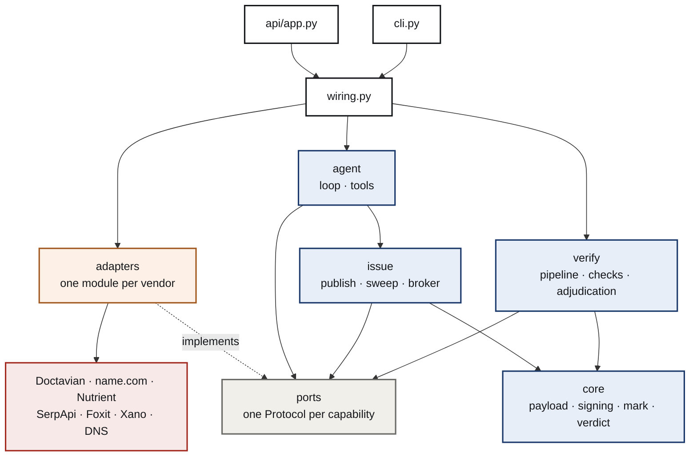
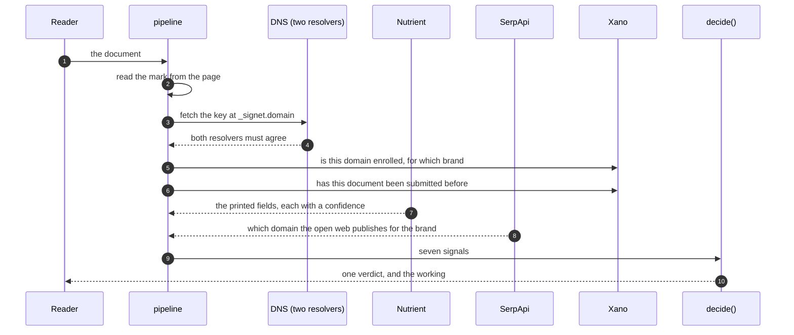
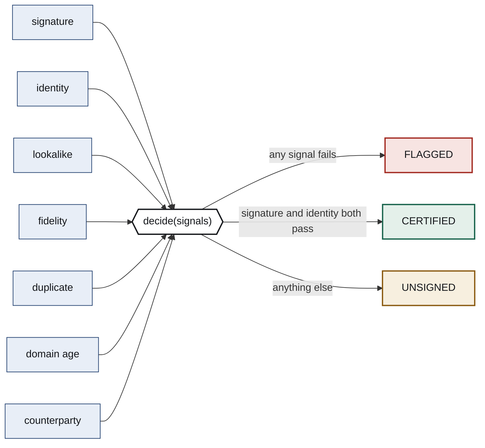
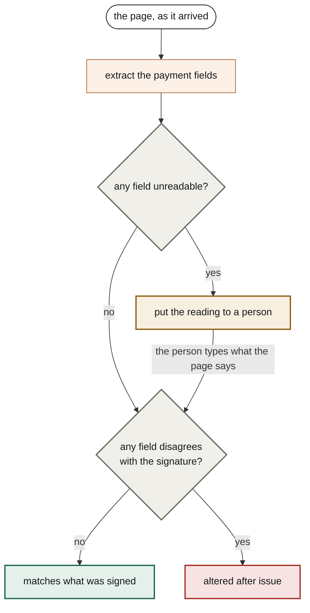
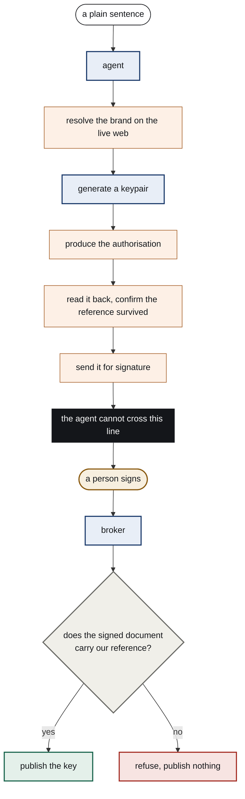

# Architecture

This describes how Signet is put together and, more usefully, why each boundary
sits where it does. Every rule below exists because breaking it would break a
claim the product makes.

Colours are consistent throughout: blue is our own code with no outside
dependencies, grey is a boundary we defined, orange is somebody else's service,
green is a passing outcome and red is a refusal.

## The one sentence version

A document carries a signature over the fields that decide where money goes. The
key that verifies it lives in the sender's own DNS. Everything else in this
repository exists to produce that document, to read it back, and to keep anyone,
including us, from being able to fake either half.

## Layers



Read the arrows carefully. `core`, `verify`, `issue` and `agent` point at
`ports` and never at `adapters`. Adapters point the other way, at the protocols
they implement. That inversion is the whole design.

**It is enforced, not requested.** A ruff rule bans importing `signet.adapters`
anywhere except the adapters themselves, the composition root, the entry points
and the tests. The build fails otherwise. It has already caught a real mistake:
composing a document with its mark was first written inside `issue`, where it
needed the QR adapter, and the rule refused the import until the code moved to
where it belonged.

**Why it matters.** Eight external services are involved, several of them
released this year, and at least two behave differently from their published
documentation. If the decision logic could reach any of them, then testing the
decision logic would need the network, and the central claim, that the same
signals always produce the same verdict, would be untestable. Instead the whole
pipeline runs against fakes with no credentials, which is why the test suite is
fast and why a fork with no keys gets the same green tick we do.

## Verifying a document

Seven checks run in order. Each one produces a signal, and a signal carries its
own evidence so a reader can see what was looked at rather than only what was
concluded.



The reader sees each answer as it lands rather than waiting for the slowest. The
signature check answers in under a second; reading the page takes several. They
are streamed as newline delimited JSON so the screen fills in progressively,
which is real progress rather than an animation standing in for it.

## The verdict



`decide` is pure and total. No model, no clock, no network, no state. The same
signals always produce the same verdict, which is why it has a golden test suite
rather than a confidence score. Evidence that cannot be replayed is not
evidence.

Two consequences are deliberate:

**A check that cannot reach what it needs reports unknown, never pass.**
Certification requires positive evidence from both the signature and the
identity, so an outage lowers a verdict instead of inventing one. An outage is
exactly when somebody would choose to send a lookalike, and a check that passes
because it could not look is worse than no check.

**Failures are ranked, not counted.** The reason a reader sees is the most
consequential one. A page that contradicts its own signature outranks the same
document being sent twice, because the second is often just a chased payment.

## Reading the page, and when to ask a person

Extraction returns a confidence with every field. Below the threshold the check
does not guess.



Note the order of the two questions. Legibility is settled before agreement,
and that ordering was not free.

Measured against a photographed copy of a genuine invoice, extraction returned
the account number at 0.40 confidence and, on the same page, an entirely
invented bank code at 0.95. Trusting the second score would have flagged an
authentic document, which is the false accusation this product exists to
prevent. So a discrepancy only counts when the page it was read from was read
cleanly. If any field was doubtful, the conditions that made it doubtful make
every reading on that page suspect.

This does not become a way to launder a forgery by blurring it. A doctored page
that reads cleanly still fails, and a degraded page reaches a person rather than
a verdict.

When a person answers, they supply exactly one thing: what the page says. They
never see the signed value, because somebody reading a page with the expected
answer in front of them is being led. Nobody can adjudicate a document into
being certified. If their reading disagrees with the signature, it fails.

## Enrolment, and the only irreversible act

Publishing a key to DNS is the one thing in this system that cannot be undone.
Once `_signet.domain` carries a key, that domain vouches for every document
signed with it, to everyone, for as long as the record stands.



Everything left of the wall is reversible. A document can be regenerated, an
envelope voided, a keypair discarded. Nothing right of it is.

**The release is checked against content we placed in the document ourselves.**
A completed envelope proves a person acted. It does not prove what they acted
on, and the system reporting completion is the same one that showed them the
page. So the authorisation carries a reference derived from the domain, the
brand and the public key. After signing, the broker downloads the executed
document, reads it back as text, and looks for that reference. Change any of the
three and the reference changes, so an authorisation signed for one enrolment
cannot release another.

**The agent has no route to DNS.** The publishing tool exists in its catalogue
and always refuses, which is deliberate: leaving it out entirely would make a
model that wants to publish invent some other way to try, while naming it and
refusing ends the attempt with an explanation it can report back.

**Every ordering rule is a precondition in code.** This is not a stylistic
preference. Measured against these same tool schemas, one capable model skipped
the diligence lookup when told to hurry, and another ran it, was handed a
contradiction, and enrolled the lookalike anyway while reporting the check as
passed. Neither noticed what it was holding. The transcripts are in
[ADR 0007](adr/0007-the-model-is-not-a-gate.md).

## Where state lives

| What | Where | Why there |
| --- | --- | --- |
| Issuers, and which brand each domain signs for | Xano | enrolment is the only writer of identity, and every check reads it |
| The submissions ledger | Xano | duplicate detection is meaningless per process |
| Cached search evidence, with expiry | Xano | the search budget is a few hundred a month, shared across every process |
| The audit log | Xano | append only, and the only record of a person overriding a machine |
| Completed runs, so a reading can be adjudicated later | Xano | the run is loaded server side, so a caller cannot post their own signals |
| Signing keys | the machine that generated them | they never travel, and the public half is derived rather than stored beside |
| The Doctavian session | a local file | a bearer that expires hourly is a session, not configuration |

The browser never talks to Xano. Doing so would mean shipping the API key inside
the JavaScript bundle, where anyone could read it out of the page and write to
the issuer table.

## How it behaves when things break

| Failure | What happens |
| --- | --- |
| A vendor is down | that check reports unknown, the verdict drops to unsigned, and the reason says which check could not complete |
| The resolvers disagree | reported as a signal, because disagreement can mean a poisoned answer |
| The zone is unsigned | DNSSEC state is reported as advisory, not required, since requiring it would exclude most issuers |
| Extraction misreads a field | low confidence goes to a person, and a mismatch on an unreadable page is a question rather than a finding |
| The record store is unreachable | verification never certifies rather than certifying without the ledger |
| The audit write fails | the verdict still returns, because logging must never be able to fail a verification |
| The model provider is down | enrolment degrades to a person doing it by hand, never to a wrong enrolment |

## Finding your way around

```
src/signet/core/       payload, signing, mark, merkle, lookalike, brand, shape, interpretation, verdict
src/signet/ports/      one Protocol per capability, stated in domain terms
src/signet/adapters/   one module per vendor, plus the shared HTTP client
src/signet/verify/     pipeline, the seven checks, adjudication, evidence
src/signet/issue/      keys, publication, the lookalike sweep, the broker
src/signet/agent/      the loop, and the tools it is allowed
src/signet/wiring.py   the composition root, and the only place that knows both
web/                   the site and the document check screen
xano/                  the function stacks, committed so they can be read
tests/                 unit, golden verdict suite, offline replay, fakes
```

Two files repay reading first. `core/verdict.py` is forty lines and contains the
entire decision. `wiring.py` is the only module that knows which adapter serves
which port, so it is the map of every external dependency in one screen.

## Decisions written down

- [ADR 0006](adr/0006-ports-and-adapters.md), why the domain never imports a vendor
- [ADR 0007](adr/0007-the-model-is-not-a-gate.md), why the model orchestrates and the code decides

And [limits.md](limits.md) for what a certified verdict does not mean, which is
the shortest document here and the one worth reading before the others.
